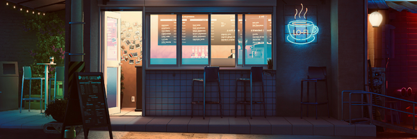

<pre>
Hey there! 👋🏼
This is one of my personal slices of the WWW.
I like working on diffrent things that interest me, 
feel free to contribute if they interest you too :) 

 
You can also find me at:
</pre>

